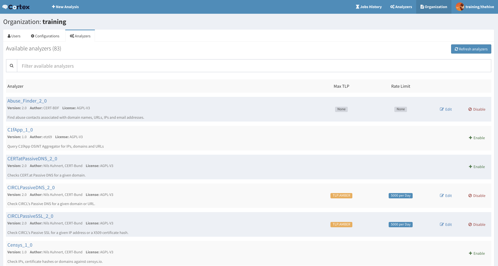

The following repository is used by [TheHive Project](https://thehive-project.org)
to develop and store [Cortex](https://github.com/CERT-BDF/Cortex/blob/master/README.md)
analyzers.



Analyzers can be written in any programming language supported by Linux such 
as Python, Ruby, Perl, etc. Refer to the [How to Write and Submit an Analyzer](https://github.com/CERT-BDF/CortexDocs/blob/master/api/how-to-create-an-analyzer.md)
page for details on how to write and submit one.

To configure analyzers, please read the [Cortex Analyzer Requirements Guide](https://github.com/CERT-BDF/CortexDocs/blob/master/analyzer_requirements.md).

# Cortex-Analyzers and Docker
[](https://github.com/3c7/Cortex-Analyzers/tree/features/dockerized)

This is in an early testing stage. Do not use the "dockerized" analyzers in production environments. To build the docker images, the script `./build_docker_images.sh` can be used which creates two base images (Python 2 and Python 3) based on alpine linux and iterates over the Dockerfiles available in analyzers-docker. To use the analyzers in Cortex, the path has to be changed from `analyzers` to `analyzers-docker`. Every analyzer runs in the respective docker container in interactive mode. Analyzer can be tested in the following way:
```
#               IMAGE NAME                      python(3)     python module
$ docker run -i cortex-analyzers-abuse_finder   python        abuse_finder.py <<< '{
"dataType": "domain",
"data": "google.de"
}'
{<output here>}
```

# License
**Unless specified otherwise**, analyzers are released under the [AGPL](https://github.com/CERT-BDF/Cortex-analyzers/blob/master/LICENSE) (Affero General Public License).

If an analyzer is released by its author under a different license, the subfolder corresponding to it will contain a *LICENSE* file.

# Updates
Information, news and updates are regularly posted on [TheHive Project Twitter account](https://twitter.com/thehive_project) and on [the blog](https://blog.thehive-project.org/).

# Contributing
We welcome your **[contributions for new analyzers](https://github.com/CERT-BDF/CortexDocs/blob/master/api/how-to-create-an-analyzer.md)**
that can take away the load off overworked fellow analysts or improvements to existing ones. Please feel free to fork the code, play with it, make some patches and send us pull requests using [issues](https://github.com/CERT-BDF/Cortex-analyzers/issues).

**Important**: To make it easy for every one, please send **one** pull request per analyzer. It will help us reviewing the code, and merging as soon as feasible.

We do have a [Code of conduct](code_of_conduct.md). Make sure to check it out before contributing.

# Support
if you encounter an issue with an analyzer or would like to request a new one or an improvement to an existing analyzer, please open an issue on the [analyzers' dedicated GitHub repository](https://github.com/CERT-BDF/Cortex-Analyzers/issues/new).

Alternatively, if you need to contact the project team, send an email to <support@thehive-project.org>.

# Community Discussions
We have set up a Google forum at <https://groups.google.com/a/thehive-project.org/d/forum/users>. To request access, you need a Google account. You may create one [using a Gmail address](https://accounts.google.com/SignUp?hl=en) or [without one](https://accounts.google.com/SignUpWithoutGmail?hl=en).

# Website
<https://thehive-project.org/>
